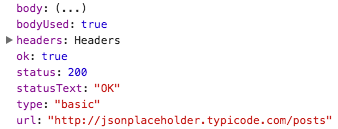

# What the `fetch`?
_A `XHR` replacement for the modern web_.

---

## HowTo: Raw `XHR`
Doing `XHR` without `fetch` looks something like this:

```javascript
// Simple XHR request in pure JavaScript
var xhr = new XMLHttpRequest();
xhr.open('GET', 'http://my.api.com/data', true);
xhr.onload = function(e) {
  // Do something with the request here
  // NOTE: Both success and error handling
  // needs to happen here
  // NOTE: Don't forget to parse the body!
}
xhr.send('');
```

Hopefully we can all agree this stinks

## Enter `fetch`

Using fetch we can simply the above code and make it far easier to work with

_NOTE: We will use some ES6 just for fun_

```javascript
// Make the request (returns a `Promise`)
fetch('http://my.api.com/data')
  // Convert the body to `JSON`. Headers
  // are available at this state so you can
  // handle the response here without parsing
  // the body if you'd like
.then(res => res.json)
.then(res => {
  // Do stuff with `res`
});
```

## Customizing `fetch` request
Similar to `$.ajax` and `$http`, `fetch` takes a config object that will allow a user to configure the headers, body, method and other properties of the request (A full list can be seen under the `init` label [here](https://developer.mozilla.org/en-US/docs/Web/API/Request/Request#Parameters)).

So if I wanted to send a different type of request or addition headers I could modify the request I sent before with a simple object:

```javascript
var config = {
  method: 'HEAD',
  headers: {
    'Authorizationn': 'My Auth Key'
  }
}

fetch('http://my.api.com/data', config)
...
```

## `fetch` response
The value passed to the `.then` of the returned promise is fully documented [here](https://developer.mozilla.org/en-US/docs/Web/API/Response). It contains all of the headers and status properties that you need in addition to a several options for parsing the body:

- `arrayBuffer`
- `blob`
- `formdata`
- `json`
- `text`

For my purposes here I want to parse the body as `JSON` so I return `res.json()` and the parsed value is available to me in the next `.then` of the promise.

_An example of the properties available in `response`_

;

## Using `fetch`
The browser support of `fetch` is still limited to Firefox and Chrome (http://caniuse.com/#feat=fetch). That said there is a polyfill available! Head on over to https://github.com/github/fetch to check it out.

Detecting feature support is fairly straightforward. Simply check for the global `fetch` object and if it doesn't exist you either need to use `XHR` or bring in the polyfill.

_An example of conditionally loading the fetch polyfill from RawGit CDN_

```javascript
if (!window.fetch) {
  let script = document.createElement('script');
  script.src = 'https://cdn.rawgit.com/github/fetch/master/fetch.js';
  script.async = true;
  document.head.appendChild(script);
}
```
